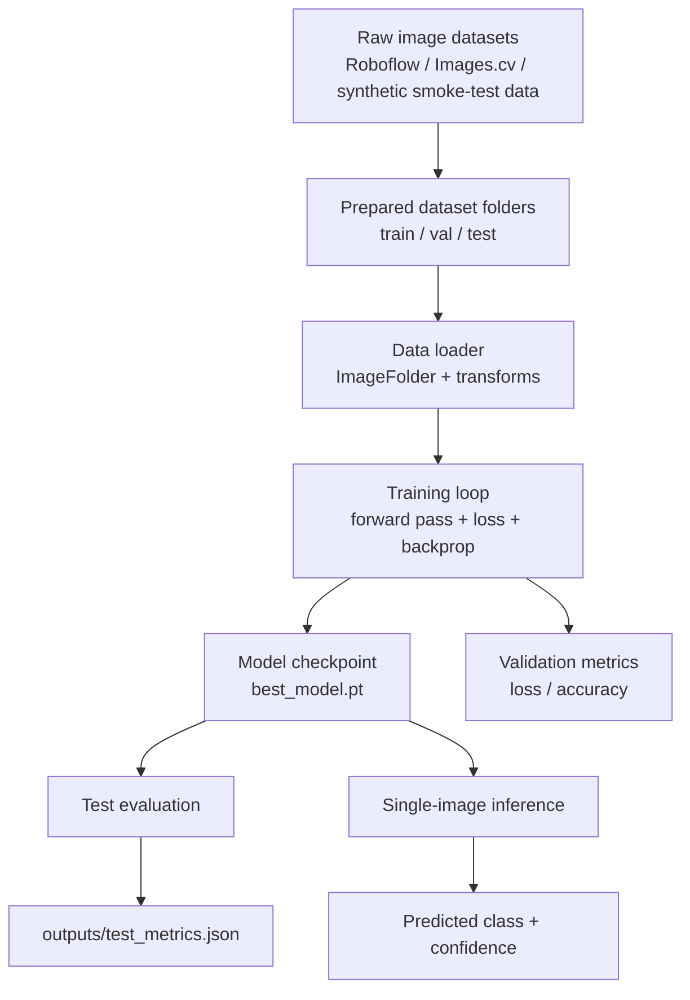
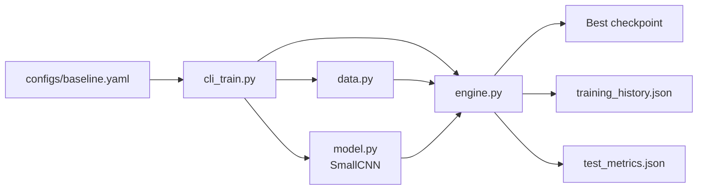
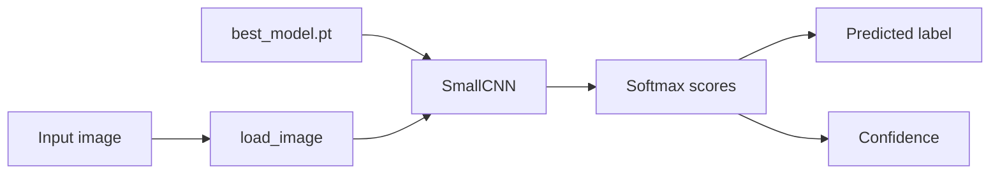

# ML Pipeline Architecture

This document shows the current MVP architecture for the emergency vehicle classification project.

## End-to-End Flow

## Training Architecture

## Inference Architecture

## Component Summary

- `configs/baseline.yaml`: runtime configuration for paths and training hyperparameters
- `src/emergency_vehicle_classifier/data.py`: dataset loading and image preprocessing
- `src/emergency_vehicle_classifier/model.py`: CNN model definition
- `src/emergency_vehicle_classifier/engine.py`: training and evaluation logic
- `src/emergency_vehicle_classifier/cli_train.py`: training entrypoint
- `src/emergency_vehicle_classifier/cli_infer.py`: inference entrypoint
- `outputs/`: saved metrics for experiments
- `models/`: saved trained checkpoints

## Current MVP Boundaries

- Input is image classification, not object detection
- Inference is single-image prediction, not video tracking
- Metrics are written to JSON for reporting and reproducibility
- The same structure can be extended later to real datasets and richer models
