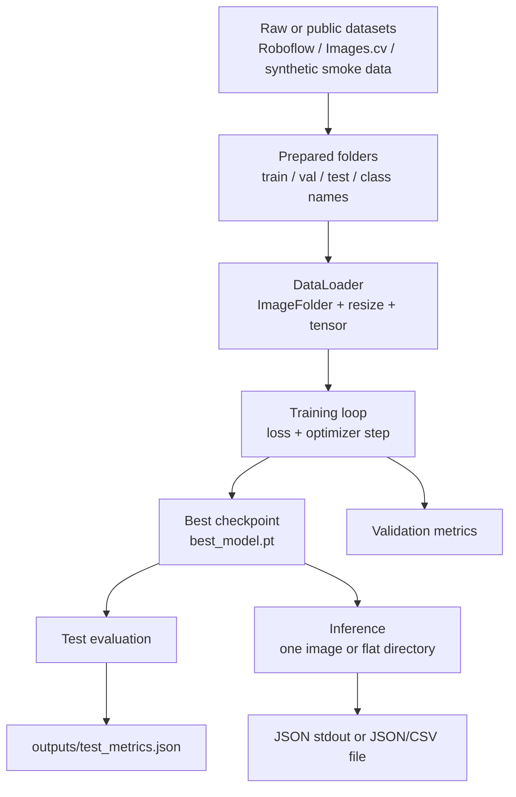
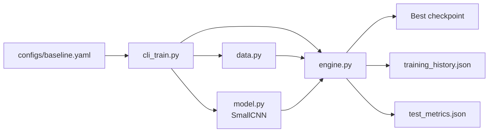

# ML Pipeline Architecture

This document describes the **current** MVP architecture for emergency vs non-emergency classification, and how it aligns with a typical **ML lifecycle** (similar to SDLC: requirements → build → validate → deliver artifacts → operate).

## End-to-End Flow

## Training Architecture

## Inference Architecture

## Quality Gate (Smoke)

`scripts/smoke_pipeline.py` (and `tests/test_smoke_pipeline.py`) exercise the same stages on **tiny synthetic** data under `data/smoke_processed/` with `configs/smoke.yaml`, writing to `models/smoke/` and `outputs/smoke/`. This verifies that training and inference entrypoints stay wired without touching real `data/processed/`.

## Component Summary

- `configs/baseline.yaml`: paths and hyperparameters for real training
- `configs/smoke.yaml`: small CPU-friendly run for automation
- `src/emergency_vehicle_classifier/data.py`: `ImageFolder` loaders and `load_image` for inference
- `src/emergency_vehicle_classifier/model.py`: CNN classifier
- `src/emergency_vehicle_classifier/engine.py`: one epoch train + evaluation metrics
- `src/emergency_vehicle_classifier/cli_train.py` / `cli_infer.py`: training CLI; inference (single image or **flat-directory** batch, optional `.json` / `.csv`)
- `outputs/`: metrics and batch predictions
- `models/`: checkpoints

## Current MVP Boundaries

- Input is **image classification**, not object detection (crops or full frames are assumed given).
- Batch inference scans **one directory level** (non-recursive); nested folders are not walked.
- Metrics are JSON for reproducibility and grading.

## Roadmap Toward ARCHITECTURE_PROPOSAL.md

The proposal targets **three classes** (civilian / overt LE / covert LE) and richer backbones (ViT / MAE / ArcFace). The **pipeline shape stays the same**: prepared folders (or a future manifest), config YAML, train/eval, checkpoint, infer. What changes is **class semantics**, **dataset curation**, and **model class** (e.g. swap `SmallCNN` for a pretrained ViT while reusing `engine.py` patterns). See `ARCHITECTURE_PROPOSAL.md` and the **Roadmap** section in `README.md`.
